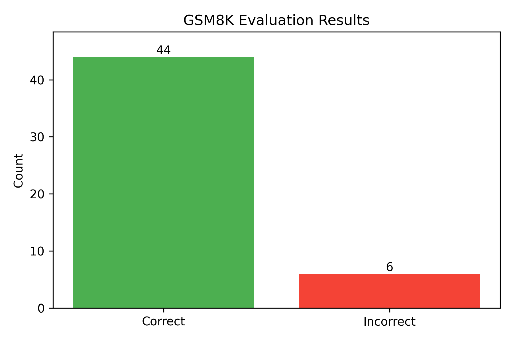
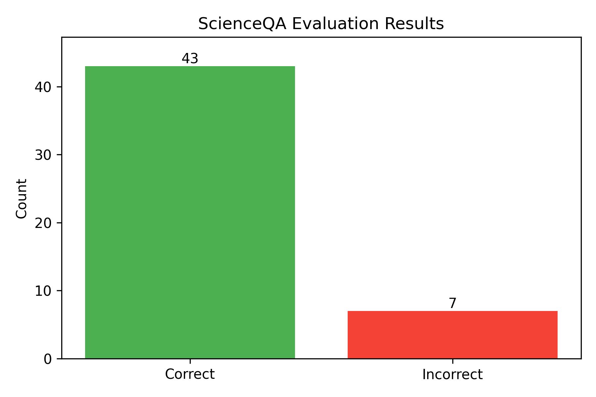

 # 第三次大作业实验报告

 > 说明：本报告基于代码 `task1_gsm8k.py` 和 `task2_scienceqa.py` 的实际运行结果撰写。
 > 结果统计来自 `task1_results.json` 和 `task2_results.json`，并整理成表格展示。

---

 ## 一、实验背景与任务说明

 本次作业要求在两个公开数据集上评测开源大模型的推理与多模态理解能力，并且不要只“调用 API”，而是要真正理解并实现完整的推理 pipeline。

 - **任务一：LLM 数学推理评测（GSM8K）**  
   使用 7B 级别的开源指令模型，对 GSM8K 小学数学推理数据集进行评测。

 - **任务二：MLLM 多模态科学问答（ScienceQA）**  
   使用 7B 级别的多模态开源模型，对包含图片的 ScienceQA 题目进行多模态选择题问答评测。

 在实现中，分别选用：

 - 文本任务：`Qwen/Qwen2.5-7B-Instruct`
 - 多模态任务：`Qwen2-VL-7B-Instruct`

 两者均采用 4-bit 量化，以在有限显存上完成实验。

---

 ## 二、任务一：GSM8K 数学推理评测

 ### 1. 实验目的

 - **评测大语言模型在小学数学推理任务上的表现**，观察其对多步数值推理题的正确率。
 - **搭建从数据集到评测指标的完整 pipeline**：包括数据加载、随机采样、提示词设计、推理生成、答案解析和结果可视化。
 - **体验量化推理的效果**：在保证模型可运行的前提下使用 4-bit 量化，直观感受在有限算力下做 LLM 实验的方式。

 ### 2. 模型与数据集

 - **数据集：GSM8K**
   - 来源：HuggingFace `openai/gsm8k`，配置 `"main"`，使用 `split="test"`。
   - 每条数据包含：
     - `question`：英文数学应用题。
     - `answer`：官方解答，结尾含 `#### 数值` 形式的标准答案。
   - 在 `GSM8KEvaluator.load_dataset` 中，从测试集中**随机抽取 50 条样本**用于评测，以节省时间和算力。

 - **模型：Qwen/Qwen2.5-7B-Instruct**
   - 约 7B 参数的 decoder-only Transformer 指令微调模型，适合对话、问答和数学推理。
   - 在 `__init__` 中通过 `AutoModelForCausalLM.from_pretrained` 加载：
     - `trust_remote_code=True`，使用官方 chat 模板。
     - 使用 4-bit 量化：`BitsAndBytesConfig(load_in_4bit=True, quant_type="nf4", bnb_4bit_compute_dtype=torch.float16)`。
   - 使用 `AutoTokenizer` 加载分词器，并配合 `apply_chat_template` 构造对话格式输入。

 ### 3. 实验步骤与代码分析

 #### （1）初始化评测器与模型加载

 对应代码：`GSM8KEvaluator.__init__`

 - 设置 `model_name`、`use_4bit` 和设备 `device`（CUDA / CPU）。
 - 加载 tokenizer：

   ```python
   self.tokenizer = AutoTokenizer.from_pretrained(
       model_name,
       trust_remote_code=True
   )
   ```

 - 若启用 4-bit，就构造 `BitsAndBytesConfig` 并以量化配置加载模型：

   ```python
   quantization_config = BitsAndBytesConfig(
       load_in_4bit=True,
       bnb_4bit_compute_dtype=torch.float16,
       bnb_4bit_use_double_quant=True,
       bnb_4bit_quant_type="nf4",
   )

   self.model = AutoModelForCausalLM.from_pretrained(
       model_name,
       quantization_config=quantization_config,
       device_map="auto",
       trust_remote_code=True,
   )
   ```

 - 否则，以 `torch.float16` 半精度加载。
 - 最后调用 `self.model.eval()`，进入推理模式。

 这一步等于把“选定的开源模型”真正搬进显存，为后续生成打好底座。

 #### （2）加载并随机采样测试数据

 对应代码：`GSM8KEvaluator.load_dataset`

 - 使用 HuggingFace 的 `load_dataset` 加载测试集：

   ```python
   dataset = load_dataset("openai/gsm8k", "main", split="test")
   ```

 - 固定随机种子：`random.seed(seed)`。
 - 用 `random.sample` 从所有样本中随机抽取 `num_samples=50` 条：

   ```python
   indices = random.sample(range(len(dataset)), num_samples)
   samples = [dataset[i] for i in indices]
   ```

 - 返回的 `samples` 是字典列表，每条记录含 `question` 和 `answer`。

 #### （3）构造提示词（Prompt）

 对应代码：`create_prompt`

 核心提示格式：

 ```text
 请解决以下数学问题，并给出详细的推理过程。最后请用"答案是："的格式给出最终答案。

 问题：{question}

 请一步步思考并解答：
 ```

 - 强调“**一步步思考**”，鼓励模型输出中间推理过程。
 - 要求最后使用“答案是：”固定格式输出结果，便于后续用正则解析。

 #### （4）组织对话输入并生成答案

 对应代码：`generate_answer`

 - 构造 messages：

   ```python
   messages = [
       {"role": "system", "content": "你是一个数学专家，擅长解决数学问题。"},
       {"role": "user", "content": prompt},
   ]
   ```

 - 使用 chat 模板构造模型输入：

   ```python
   text = self.tokenizer.apply_chat_template(
       messages,
       tokenize=False,
       add_generation_prompt=True,
   )
   inputs = self.tokenizer([text], return_tensors="pt").to(self.device)
   ```

 - 生成阶段：

   ```python
   outputs = self.model.generate(
       **inputs,
       max_new_tokens=max_new_tokens,
       do_sample=False,
       temperature=1.0,
       top_p=1.0,
   )
   ```

 - 对生成出的新 token 进行解码，得到完整的自然语言解答。

 #### （5）答案解析与数值归一化

 对应代码：`extract_answer` 与 `normalize_answer`

 - `extract_answer` 通过多种正则表达式尝试从文本中抽取数值答案，例如：
   - `r'####\s*([+-?[\d,]+\.?\d*)'`
   - `r'答案是[：:]\s*([+-?[\d,]+\.?\d*)'` 等。
 - 若这些模式都未命中，则用 `re.findall` 提取文本中的所有数字，**取最后一个**作为猜测的最终答案。
 - `normalize_answer` 去掉逗号后尝试转成浮点数；若转换失败，返回 `inf`，在后续比较中视为错误。

 #### （6）逐样本评测与准确率计算

 对应代码：`evaluate`

 - 遍历采样得到的每一道题：
   - 从官方解答 `sample['answer']` 中抽取数值 `gt_answer`，再归一化为 `gt_value`。
   - 调用 `generate_answer(question)` 得到生成文本，抽取 `pred_answer`，归一化为 `pred_value`。
   - 按 `abs(pred_value - gt_value) < 1e-2` 判断是否正确。
   - 保存包括题目、标准答案、预测答案、原始生成文本和 `correct` 标记在内的字典到 `results` 列表。
 - 统计正确数 `correct` 和总数 `total`，计算 `accuracy = correct / total`。
 - 遇到异常会捕获并记录为 `"predicted": "ERROR"`，避免单个样本导致程序崩溃。

 #### （7）结果保存与可视化

 - 将整体信息写入 `task1_results.json`，包含：

   ```json
   {
     "model": self.model_name,
     "total_samples": total,
     "correct": correct,
     "accuracy": accuracy,
     "results": results
   }
   ```

 - 使用 `matplotlib` 绘制 `Correct/Incorrect` 柱状图：
   - X 轴为 `["Correct", "Incorrect"]`；
   - Y 轴为数量；
   - 顶部标注具体数字；
   - 保存为 `task1_accuracy.png`。

 `main()` 中的流程：创建评测器 → 加载 50 条样本 → 评估并保存 → 在控制台打印整体结果。

 ### 4. 实验结果与表格展示

 根据 `task1_results.json`，GSM8K 上的评测整体统计如下表所示。

 **表 1  GSM8K 评测总体结果**

| 指标       | 数值                      |
| ---------- | ------------------------- |
| 模型       | Qwen/Qwen2.5-7B-Instruct |
| 测试样本数 | 50                        |
| 答对题数   | 44                        |
| 答错题数   | 6                         |
| 准确率     | 0.88（约 88.00%）        |
| 结果文件   | `task1_results.json`     |
| 准确率图像 | `task1_accuracy.png` |

 从表中可以看到，在随机抽取的 50 道 GSM8K 题目上，模型共答对 44 题，整体准确率约为 **88%**。就小学数学应用题来说，这个表现已经比较不错，但仍然存在一定比例的错误。

 为了直观展示模型的行为，可以从结果文件中选取几道代表性题目（这里只举两个例子）：

 - **示例一：推理过程正确但数值有偏差（错误样例）**  
   
   
   
   ```json
   	  "index": 0,
         "question": "The girls are trying to raise money for a carnival. Kim raises $320 more than Alexandra, who raises $430, and Maryam raises $400 more than Sarah, who raises $300. How much money, in dollars, did they all raise in total?",
         "ground_truth": "2280",
         "predicted": "2180",
         "generated_text": "为了解决这个问题，我们需要逐步计算每个人筹集的资金总额，然后将这些金额相加得到总和。\n\n1. 首先，我们知道Alexandra筹集了$430。\n2. 根据题目，Kim比Alexandra多筹集了$320，因此Kim筹集的金额为：\n   \\[430 + 320 = 750\\] 美元。\n3. 接着，Sarah筹集了$300。\n4. Maryam比Sarah多筹集了$400，因此Maryam筹集的金额为：\n   \\[300 + 400 = 700\\] 美元。\n\n现在，我们把所有人筹集的金额加起来得到总数：\n\n\\[430（Alexandra）+ 750（Kim）+ 300（Sarah）+ 700（Maryam）= 2180\\]\n\n所以，他们总共筹集了2180美元。\n\n答案是：2180美元。",
         "correct": false
   ```
   
   
   
   - 题目大意：`The girls are trying to raise money for a carnival. Kim raises $320 more than Alexandra, who raises $430, and Maryam raises $400 more than Sarah, who raises $300. How much money, in dollars, did they all raise in total?`
   
   - 标准答案：`2280`，模型预测：`2180`。  
   
   - 生成文本：
   
     ```
     为了解决这个问题，我们需要逐步计算每个人筹集的资金总额，然后将这些金额相加得到总和。
     1. 首先，我们知道Alexandra筹集了$430。\n
     2. 根据题目，Kim比Alexandra多筹集了$320，因此Kim筹集的金额为：\n   \\[430 + 320 = 750\\] 美元。\n
     3. 接着，Sarah筹集了$300。\n
     4. Maryam比Sarah多筹集了$400，因此Maryam筹集的金额为：\n   \\[300 + 400 = 700\\] 美元。\n\n
     
     现在，我们把所有人筹集的金额加起来得到总数：\n\n
     \\[430（Alexandra）+ 750（Kim）+ 300（Sarah）+ 700（Maryam）= 2180\\]
     \n\n所以，他们总共筹集了2180美元。\n\n
     答案是：2180美元。
     ```
   
     ```
     "index": 44,
           "question": "Ten stalls have 20 cows each. Mr. Sylas buys 40 cows and divides them equally, putting an equal number of the new cows into each of the twenty stalls. How many cows are in 8 of the stalls?",
           "ground_truth": "192",
           "predicted": "176",
           "generated_text": "首先，我们来逐步分析这个问题：\n\n1. **初始情况**：\n   - 有10个牛棚。\n   - 每个牛棚有20头牛。\n   - 因此，总共有 \\(10 \\times 20 = 200\\) 头牛。\n\n2. **Mr. Sylas购买的牛**：\n   - Mr. Sylas买了40头牛。\n\n3. **将新买的牛分配到每个牛棚**：\n   - 需要将这40头牛平均分配到20个牛棚中。\n   - 每个牛棚增加的牛的数量为 \\(40 \\div 20 = 2\\) 头牛。\n\n4. **计算每个牛棚的新牛数量**：\n   - 原来的每牛棚有20头牛，加上2头新买的牛后，每个牛棚现在有 \\(20 + 2 = 22\\) 头牛。\n\n5. **计算8个牛棚中的牛的数量**：\n   - 如果每个牛棚有22头牛，那么8个牛棚中的牛的总数为 \\(8 \\times 22 = 176\\) 头牛。\n\n因此，答案是：176头牛在8个牛棚中。",
           "correct": false
     ```
   
     
   
   - 从生成文本可以看到，模型推理过程基本正确，但在最后一步求和时少算了 100，说明模型在多步加法的最后汇总阶段偶尔会“粗心”。
   
 - **示例二：多步推理较为稳定（正确样例）**  
   
   - 题目大意：`"Ten stalls have 20 cows each. Mr. Sylas buys 40 cows and divides them equally, putting an equal number of the new cows into each of the twenty stalls. How many cows are in 8 of the stalls?"`
   
   - 标准答案：`192`，模型预测：`176`。  
   
   - 生成文本：
   
     ```
     首先，我们来逐步分析这个问题：\n\n
     1. **初始情况**：\n   - 有10个牛棚。\n   - 每个牛棚有20头牛。\n   - 因此，总共有 \\(10 \\times 20 = 200\\) 头牛。\n\n
     2. **Mr. Sylas购买的牛**：\n   - Mr. Sylas买了40头牛。\n\n
     3. **将新买的牛分配到每个牛棚**：\n   - 需要将这40头牛平均分配到20个牛棚中。\n   - 每个牛棚增加的牛的数量为 \\(40 \\div 20 = 2\\) 头牛。\n\n
     4. **计算每个牛棚的新牛数量**：\n   - 原来的每牛棚有20头牛，加上2头新买的牛后，每个牛棚现在有 \\(20 + 2 = 22\\) 头牛。\n\n
     5. **计算8个牛棚中的牛的数量**：\n   - 如果每个牛棚有22头牛，那么8个牛棚中的牛的总数为 \\(8 \\times 22 = 176\\) 头牛。\n\n
     因此，答案是：176头牛在8个牛棚中。
     ```
   
     
   
   - 模型先计算出各档位的日去除量，再乘以天数并相加，推理过程条理清晰，和标准解法基本一致。

 配合 `task1_accuracy.png` 的柱状图，可以一眼看出正确题目明显多于错误题目，验证了表格中的统计结果。

 ### 5. 任务一实验心得

 在做 GSM8K 这个任务的时候，我的直观感受是：真正花时间的其实不是“调模型”，而是把完整的评测流程搭好。
 以前用在线 API 的时候，往往只关心一句函数调用，这次自己用 `transformers` 把 `tokenizer`、`apply_chat_template`、`generate` 等步骤串起来，才更清楚一个 LLM 推理到底发生了什么。

 另外，4-bit 量化确实降低了显存压力，让 7B 模型在相对有限的 GPU 上也能跑起来。当然，量化后的模型可能在数值上会有一点损失，但在这次 50 道题的小规模评测里，整体表现还是挺稳定的。

 从错误案例来看，模型经常不是完全“不会算”，而是中间步骤没理清，或者最后写答案的时候少看了一个数字。整体来说，这个实验让我对“如何评测一个开源 LLM 的数学推理能力”有了更清晰的概念。

---

 ## 三、任务二：ScienceQA 多模态问答评测

 ### 1. 实验目的

 - **评测多模态大模型在科学类选择题上的理解与推理能力**，尤其是需要同时利用图片和文字信息的题目。
 - **搭建图文多模态推理 pipeline**：从数据中过滤出带图片的样本，构造“图 + 文 + 选项”的输入，进行生成，再从自然语言回答中解析出最终选项。
 - **理解多模态模型的输入格式与预处理流程**，包括图像处理、chat 模板和多模态 processor 的配合。

 ### 2. 模型与数据集

 - **数据集：ScienceQA**
   - 使用 HuggingFace 数据集 `derek-thomas/ScienceQA`，`split="test"`。
   - 主要字段：
     - `image`：题目配图；
     - `question`：问题文本；
     - `choices`：多个备选答案；
     - `answer`：正确选项的索引（0 表示 A，1 表示 B，以此类推）；
     - `hint`：部分题目附带的提示文字。
   - 在 `load_dataset` 函数中，只保留 `image` 字段非空的样本，确保评测是真正的“多模态”任务。

 - **模型：Qwen2-VL-7B-Instruct**
   - Qwen2 系列的视觉语言模型，支持输入图像和文本。
   - 在 `ScienceQAEvaluator.__init__` 中加载：

     ```python
     self.processor = AutoProcessor.from_pretrained(
         model_name,
         trust_remote_code=True,
         use_fast=False,
     )
     ```

   - 根据 `use_4bit` 决定是否构造 `BitsAndBytesConfig` 以量化方式加载 `Qwen2VLForConditionalGeneration`。
   - 使用官方工具 `process_vision_info` 预处理图像，确保输入格式和模型要求一致。

 ### 3. 实验步骤与代码分析

 #### （1）初始化评测器与模型加载

 对应代码：`ScienceQAEvaluator.__init__`

 - 设定 `model_name` 和 `use_4bit`，检测设备。
 - 初始化 `AutoProcessor`，统一处理文本和图像输入。
 - 根据 `use_4bit` 决定是否使用量化配置加载 `Qwen2VLForConditionalGeneration`。
 - 模型切换到 `eval` 模式并打印完成信息。

 #### （2）筛选含图片的样本并随机采样

 对应代码：`load_dataset`

 - 读取测试集：

   ```python
   dataset = load_dataset("derek-thomas/ScienceQA", split="test")
   ```

 - 遍历数据集，若 `sample.get('image') is not None`，则加入 `samples_with_image`。
 - 打印“找到 xx 条包含图片的样本”。
 - 使用固定随机种子，若可用样本数 ≥ 50，则用 `random.sample` 抽取 50 条；否则全部保留并给出警告。

 #### （3）选项格式化与提示词构造

 对应代码：`format_choices` 与 `create_prompt`

 - `format_choices` 用 `A,B,C,D,E,F` 为选项编号，拼成多行字符串：

   ```python
   options = ['A', 'B', 'C', 'D', 'E', 'F']
   formatted = []
   for i, choice in enumerate(choices):
       if i < len(options):
           formatted.append(f"{options[i]}. {choice}")
   ```

 - `create_prompt` 将问题、选项与提示整合成自然语言指令：

   ```text
   请根据图片回答以下科学问题。请仔细观察图片，分析问题，并从给定的选项中选择正确答案。
   
   问题：{question}
   
   选项：
   {formatted_choices}
   
   提示：{hint}
   
   请直接给出你认为正确的选项字母（A/B/C/D等），并简要说明理由。
   答案是：
   ```

 #### （4）多模态输入组织与生成

 对应代码：`generate_answer`

 - 构造多模态 messages：

   ```python
   messages = [
       {
           "role": "user",
           "content": [
               {"type": "image", "image": image},
               {"type": "text", "text": prompt},
           ],
       }
   ]
   ```

 - 使用 `processor.apply_chat_template` 将 messages 转为模型输入文本：

   ```python
   text = self.processor.apply_chat_template(
       messages,
       tokenize=False,
       add_generation_prompt=True,
   )
   ```

 - 通过 `process_vision_info(messages)` 得到标准化图像输入，并用 `processor` 同时处理文本与图像：

   ```python
   image_inputs, video_inputs = process_vision_info(messages)

   inputs = self.processor(
       text=[text],
       images=image_inputs,
       videos=video_inputs,
       padding=True,
       return_tensors="pt",
   ).to(self.device)
   ```

 - 调用多模态模型生成：

   ```python
   outputs = self.model.generate(
       **inputs,
       max_new_tokens=max_new_tokens,
       do_sample=False,
       temperature=1.0,
       top_p=1.0,
   )
   ```

 - 使用 `processor.batch_decode` 对新生成部分进行解码，得到自然语言回答。

 #### （5）从回答中抽取最终选项

 对应代码：`extract_choice`

 - 根据 `num_choices` 截取合法选项集合，如 `['A', 'B', 'C']`。
 - 使用若干正则表达式匹配回答中的选项字母，如：
   - `r'答案是[：:]\s*([A-F])'`
   - `r'选项\s*([A-F])'` 等。
 - 若正则没有命中，则从整个文本中扫描第一个合法选项字母；若仍未找到，保底返回 `'A'`，避免崩溃。

 #### （6）逐样本评测、保存图片与统计准确率

 对应代码：`evaluate`

 - 对每条样本：
   - 读取 `image, question, choices, answer, hint`；
   - 把 `answer` 索引映射为字母 `ground_truth`；
   - 调用 `generate_answer` 得到自然语言回答，再用 `extract_choice` 提取预测选项 `predicted`；
   - 比较是否正确，统计 `correct` 数；
   - 若 `save_images=True`，将图片保存到 `task2_sample_images/`，文件名如 `sample_000.png`，并在结果中记录路径。
 - 处理完所有样本：
   - 计算 `accuracy = correct / total`；
   - 将结果写入 `task2_results.json`；
   - 画出 `Correct/Incorrect` 柱状图并保存为 `task2_accuracy.png`。

 `main()` 函数串起整个流程：初始化评测器 → 加载 50 条样本 → 评测保存 → 控制台打印结果。

 ### 4. 实验结果与表格展示

 根据 `task2_results.json`，ScienceQA 多模态评测整体统计如下。

 **表 2  ScienceQA（带图片样本）评测总体结果**

| 指标         | 数值                              |
| ------------ | --------------------------------- |
| 模型         | Qwen2-VL-7B-Instruct             |
| 测试样本数   | 50                               |
| 答对题数     | 43                               |
| 答错题数     | 7                                |
| 准确率       | 0.86（约 86.00%）               |
| 结果文件     | `task2_results.json`            |
| 样本图片目录 | `task2_sample_images/`（共 50 张） |
| 准确率图像   | `task2_accuracy.png` |

 从表中可以看到，在随机抽取的 50 条“含图片” ScienceQA 样本上，多模态模型答对 43 题，整体准确率约 **86%**，和文本数学推理任务的表现处在同一量级。

 结合 `task2_sample_images` 中的图片和结果文件，可以挑出一些有代表性的案例：

 - 可以看到样本#9的推理过程是正确的，但是最终输出了错误答案。其他样本推理过程和答案均正确。

 `task2_accuracy.png` 的柱状图直观展示了正确和错误题目的数量对比，从视觉上也能看到模型在该任务上整体表现较为稳定，但仍有一部分题目存在视觉或常识性的误判。

 ### 5. 任务二实验心得

 做多模态问答这部分的时候，最大的感受是：看上去只是多传一张图，实际上前处理要复杂得多。

 从代码上看，一个多模态 pipeline 至少要解决三个问题：  
 （1）怎么把图片和文本一起组织成 messages；  
 （2）怎么用 `processor` 把它们转成模型能吃的张量；  
 （3）模型回答出来之后，还要自己想办法解析出最终选项。

 实验过程中，我发现模型有时会把“图上的细节”看错，比如混淆地图上的国家、城市位置，或者误解图表中的数值变化。有些题虽然图片信息很关键，但模型给人的感觉还是在根据常识和文字去猜。这也说明，目前的多模态模型离真正“像人一样看图做题”还有距离。

 总体来说，这个实验让我对多模态模型的输入格式、`AutoProcessor` 的作用以及结果解析过程有了更直观的理解，不再只是觉得“把图片丢给模型就完事了”，而是清楚了中间到底发生了什么。

---

 ## 四、综合小结

 - 通过 **GSM8K** 文本推理任务，我搭建并跑通了一个完整的 LLM 数学评测流程，使用 4-bit 量化的 `Qwen2.5-7B-Instruct` 在 50 个测试样本上取得约 **88%** 的准确率，表现出良好的算术和应用题推理能力。
 - 通过 **ScienceQA** 多模态任务，我进一步了解了视觉-语言模型的使用方式，在 50 条带图片的题目上，`Qwen2-VL-7B-Instruct` 获得约 **86%** 的准确率，整体效果可接受，但在细粒度视觉和复杂常识问题上仍有失误。
 - 整体看下来，这次作业比起单纯“调参数”，更重要的是学习如何设计和实现一条可复现的 LLM / MLLM 实验 pipeline，从数据加载、模型调用到结果解析、可视化和表格统计都亲手走了一遍，对以后做更复杂的模型评测会很有帮助。